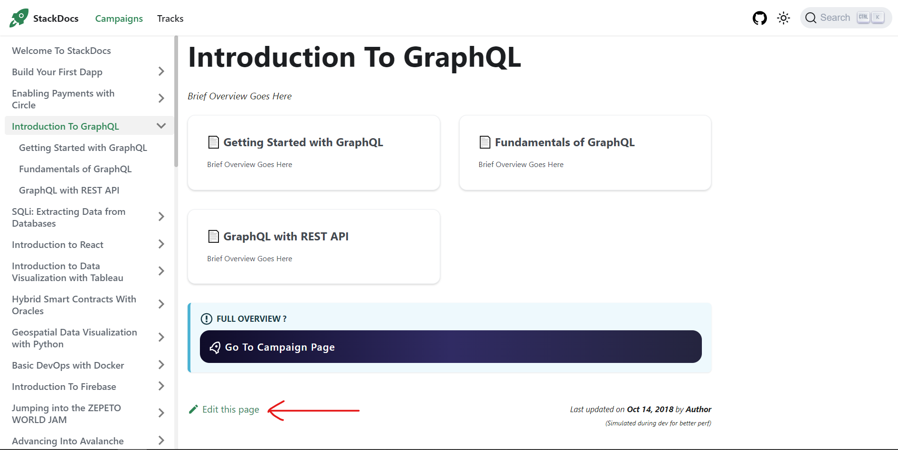
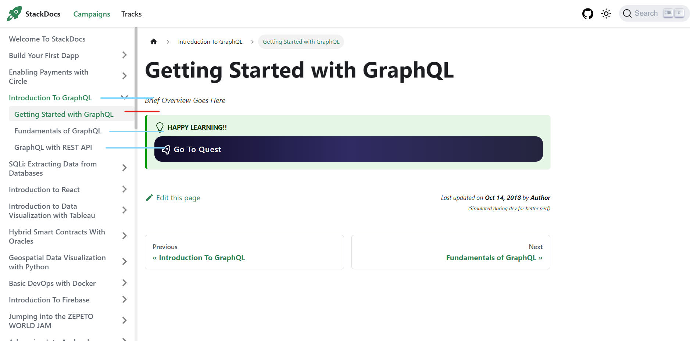

# Who Can Contribute

All stackies are free to contribute to the project in any way including opening an issue, requesting a feature, fixing a bug, adding a feature, adding new campaigns and quests on the page, updating the docs etc,

# How To Update Quest and Campaign Documentation

At the moment, All Campaign and Quest pages contain a `Brief Overview Here` text. This is a dummy text why represents a simple summary of what the StackUp Campaign or Quest Teaches.

At the base of the campaign page, you would see and button `edit this page`.

This takes you to the exact file to edit the document in the repo. Make the updates and pull a request

Optionally, you could navigate to the [docs](/docs/) folder and find the folder for the quest to update it

# Rules For Updating Campaign/Quest Documentation

Follow the steps below to avoid multiple stackies working on the same campaign page

1. Check On the [issues][issues-url] Tab If there's an issue labelled `update: <campaign-name>` e.g `update: Introduction to GraphQL` would mean the GraphQL campaign is already being updated by the person who opened the issue
2. If there's none, Create a new issue with the same format for the header i.e `update: <campaign-name>`
3. Once the issue is created, you then go ahead to make the edits on the StackDocs page i.e Remove the `Brief Overview Here` from the campaign page and all the quest pages under it and update with a few lines summarizing what the quest and campaign teach. Feel free to refer to the particular [StackUp Campaign](https://app.stackup.dev/campaigns) to use words or sentences from them
4. After doing the updates, Create a pull request with the same format `update: <campaign-name>`
5. Wait till the pull request has been merged to the `main` then you can proceed to `close` the issue

_IMPORTANT!!_

1. Single Quests cannot be updated except to fix typos. If you want to update the overview of a particular quest, you have the update the entire campaign that goes with it. i.e
   
   Want to update `Getting Started With GraphQL ? (In red) Then you have to update the other quests (in blue) and the campaign overview (in blue)
2. Ensure the `Brief Overview` is indeed brief. The main purpose of StackDocs is to provide links to the particular stackup page

# How To Create A New Campaign Or Quest On The Docs

For now, I will be adding all new campaigns and quest but I intend to provide a well detailed guide so anyone would be able do the same with ease

<!--Issues URL-->

[issues-url]: https://github.com/Complexlity/stackdocs/issues
